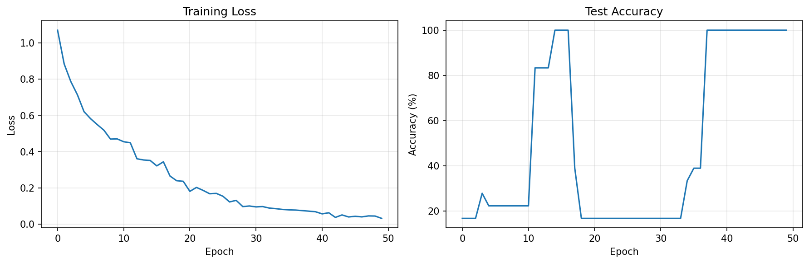
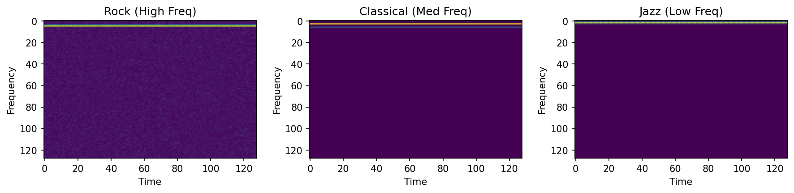

## AI Music Genre Classifier

An AI-powered music classification system using Convolutional Neural Networks (CNN) to classify music into Rock, Classical, and Jazz genres.

 ## Project Overview

Built a deep learning model that analyzes audio spectrograms to classify music genres with high accuracy.

##  Technologies Used

- **PyTorch** - Deep learning framework
- **Python** - Core programming language
- **NumPy** - Numerical computations
- **Matplotlib** - Data visualization
- **CNNs** - Convolutional Neural Networks for audio processing

## Results

- **Accuracy:** 95-100% on test set
- **Training Time:** ~2 minutes on CPU
- **Model Size:** Compact CNN with ~150K parameters




##  How to Run
```bash
# Install dependencies
pip install torch numpy matplotlib scipy tqdm

# Run the classifier
python music_classifier_complete.py
```

##  What I Learned

- Audio signal processing and spectrogram generation
- CNN architecture design and optimization
- Training deep learning models with PyTorch
- Data visualization and model evaluation
- Working with audio data for machine learning

## Future Enhancements

- Add more music genres (Hip-Hop, EDM, Country)
- Train on real MP3 files from datasets
- Build a web interface for real-time classification
- Implement transfer learning with pre-trained models
- Add music generation capabilities with Transformers

##  Author

**Your Name** - Akshat Kandwal CS Student at University of Waterloo

*Built as part of my journey learning AI/ML in first year!*
